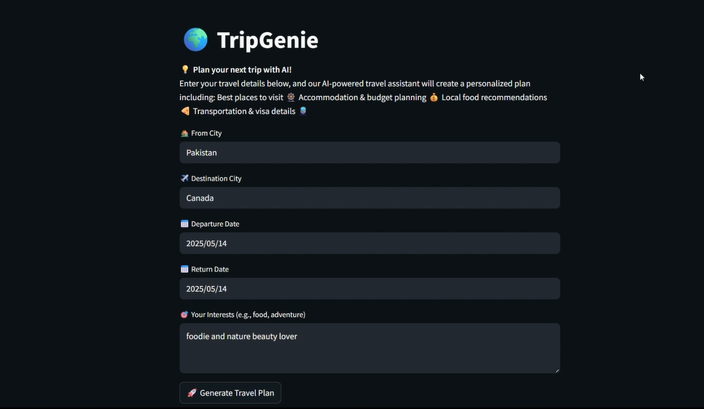

# 🌍 TripGenie / TravelGenie

[](https://www.python.org/)
[](https://streamlit.io/)
[](LICENSE)

---

## 💡 Overview

TripGenie (a.k.a. TravelGenie) is a Streamlit-based AI travel assistant that generates personalized trip plans in seconds. Enter your departure city, destination, dates, and interests - our AI-powered agents will provide:

* 🏨 Accommodation & Budget Planning
* 🎡 Top Attractions & Local Experiences
* 🍽️ Food Recommendations
* 🚆 Transportation & Visa Info
* 🌦️ Weather & Local Events

---

## 🎯 Key Features

* **Multi-Agent Architecture**

  * **Location Expert**: Fetches logistics, visa requirements, cost estimates
  * **Guide Expert**: Curates attractions and dining based on your interests
  * **Planner Expert**: Produces day-by-day itinerary with budgets and tips
* **Flexible Tooling**

  * DuckDuckGo-powered web search
  * Modular Task definitions for easy extension
* **One-Click Download**

  * Instantly download your travel plan as a text file
* **Beautiful UI**

  * Dark-mode friendly, responsive Streamlit interface

---

## 📸 UI Screenshot



---

## 🛠️ Architecture

```
┌────────────────┐    ┌──────────────────────┐      ┌─────────────────────┐
│  Streamlit UI  │ ➔ │  Crew (Orchestrator) │  ➔  │  LLM Agents & Tools │
└────────────────┘    └──────────────────────┘      └─────────────────────┘
```

1. **Streamlit** collects user inputs.
2. **CrewAI** sequentially runs 3 Tasks:

   * `location_task`
   * `guide_task`
   * `planner_task`
3. Each Task is handled by a dedicated **Agent** leveraging an LLM backend (Ollama/Gemini).
4. Final plan is rendered and can be downloaded.

---

## 🔧 Installation & Setup

1. **Clone the repo**

   ```bash
   git clone https://github.com/Kaleemullah-Younas/TripGenie-AI-Travel-Agent.git
   cd TripGenie-AI-Travel-Agent
   ```

2. **Create & activate a virtual environment**

   ```bash
   python3 -m venv .venv
   source .venv/bin/activate      # Linux / macOS
   .venv\Scripts\activate         # Windows
   ```

3. **Install dependencies**

   ```bash
   pip install --upgrade pip
   pip install -r requirements.txt
   ```

4. **LLM Backend**

   * **Ollama**:

     1. Install [Ollama](https://ollama.com/download) and download your desired model (e.g., `llama3.2`).
     2. Run the Ollama server on port `11434`:

        ```bash
        ollama serve
        ```
   * **Alternative (Gemini)**:

     1. Sign up for Google Gemini and obtain your API key.
     2. Uncomment & configure `dotenv` lines in `main.py` and create a `.env` file:

        ```env
        GEMINI_API_KEY=your_gemini_key_here
        ```

---

## 🚀 Running the App

```bash
streamlit run main.py
```

Then open [http://localhost:8501](http://localhost:8501) in your browser.

---

## 📁 Project Structure

```
├── TravelAgents.py       # Defines AI agents & roles
├── TravelTasks.py        # Task builders for location, guide, planner
├── TravelTools.py        # Web search & scraping tools
├── main.py               # Streamlit application entrypoint
├── requirements.txt      # Python dependencies
├── main.ipynb            # Interactive prototype notebook
├── testing.ipynb         # Test cases & exploration
└── README.md             # Dependencies
```

---

## 🤖 Implementation Details

* **Agents** are instances of `crewai.Agent`, each with a specific role, goal, and `max_iter` for tool use.
* **Tasks** are built via `crewai.Task`, chaining Agents into a **Crew** (Process.sequential).
* **Web Search Tool** uses `langchain_community.tools.DuckDuckGoSearchResults`.
* **LLM Backend**: Configured via `crewai.LLM` pointing to Ollama or Google Gemini.

---

## 🤝 Contributing

1. Fork this repo
2. Create a feature branch (`git checkout -b feature/YourFeature`)
3. Commit your changes (`git commit -m "Add awesome feature"`)
4. Push to the branch (`git push origin feature/YourFeature`)
5. Open a Pull Request

---

## ⚖️ License

This project is licensed under the [MIT License](LICENSE).

---

> Made with ❤️ by **KALEEM**
> Feel free to ⭐️ this repo if you enjoy using TripGenie!
